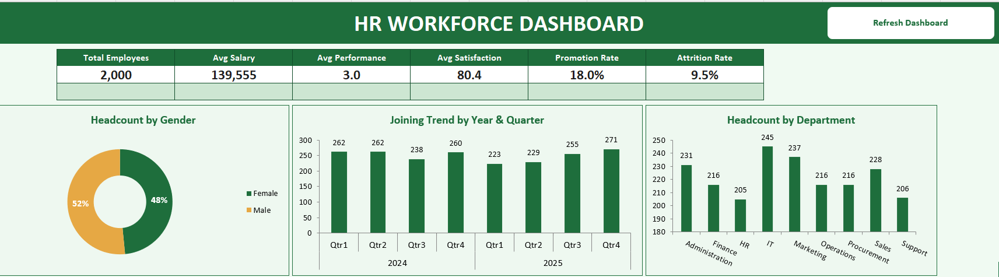
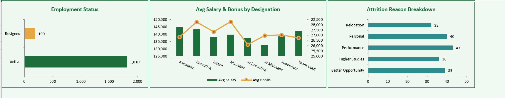
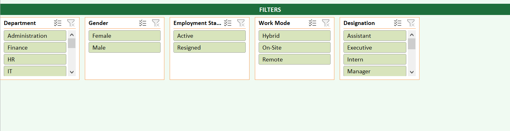

# HR Workforce Dashboard (Excel VBA)

Interactive HR Workforce Dashboard built entirely in Excel using VBA — featuring automated pivot table generation, dynamic charts, KPI cards, and cross-filtered slicers for real-time workforce analytics.

## 📊 Overview

This project automates the creation of a complete HR analytics dashboard from raw employee data. With a single click, VBA macros clean the raw dataset, generate 12+ pivot tables, and build a fully interactive dashboard with charts, KPI cards, and slicers — no manual pivot table setup required.

## ✨ Features

- **Automated Data Cleaning** — Macro converts raw data into a formatted, styled Excel table
- **12+ Auto-Generated Pivot Tables** — Department, Gender, Joining Trend, Employment Status, Work Mode, Designation, City, Education, Attrition Reason, Promotion, Performance, and Top 5 Salaries
- **Dynamic Dashboard** — KPI cards (Total Employees, Avg Salary, Avg Performance, Avg Satisfaction, Promotion Rate, Attrition Rate)
- **6 Interactive Charts** — Donut, Bar, Column, Horizontal Bar, and Combo charts, all linked directly to pivot tables
- **Cross-Filtered Slicers** — Department, Gender, Employment Status, Work Mode, and Designation slicers connected across all charts
- **Year & Quarter Grouping** — Joining trend analysis grouped by year and quarter for multi-year datasets
- **One-Click Refresh** — "Refresh Dashboard" button re-runs all pivot tables and re-applies groupings instantly

## 🖼️ Screenshots

### Dashboard Overview


### Joining Trend by Year & Quarter


### Interactive Filters


## 🛠️ Tech Stack

- Microsoft Excel (.xlsm)
- VBA (Visual Basic for Applications)
- PivotTables & PivotCharts
- Slicers

## 📁 Project Structure

```
hr-dashboard-vba/
├── HR_Workforce_Dashboard.xlsm    # Main working file
├── vba-code/                      # VBA source code (readable, non-Excel format)
│   ├── CleanAndFormatData.bas
│   ├── Pivot.bas
│   └── Dashboard.bas
├── Dashboard1.png                 # Dashboard preview images
├── Dashboard2.png
├── Filters.png
└── README.md
```
## 🚀 How to Use

1. Download `HR_Workforce_Dashboard.xlsm`
2. Enable macros when prompted (File → Options → Trust Center → Enable Macro Content)
3. Go to the **Data** sheet and paste your raw HR data (or use the sample data included)
4. Run the macro `CleanAndFormatData` to format the dataset
5. Run `CreatePivotSheets` to generate all pivot tables
6. Open the **Dashboard** sheet — click **Refresh Dashboard** to sync all charts and KPIs

## 📌 Key Learnings

This project demonstrates:
- Building end-to-end VBA automation pipelines (data cleaning → pivot generation → dashboard rendering)
- Dynamic pivot table field configuration and date grouping (Year + Quarter)
- Linking charts dynamically to pivot table sources
- Cross-connecting slicers across multiple PivotTables
- Debugging real-world VBA runtime errors (late binding, pivot cache conflicts, grouping resets on refresh)

## 📄 License

This project is licensed under the MIT License — see the [LICENSE](LICENSE) file for details.

---

**Author:** Mueeza Irfan
